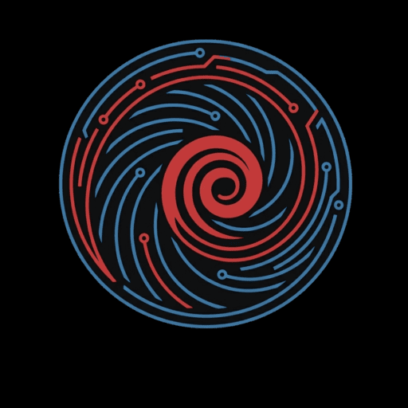

<p align="center">
  
</p>

<h1 align="center">Meb</h1>

<p align="center">
  Un outil CLI pour construire des paquets <code>.deb</code> rapidement et clairement, quel que soit le langage de ton projet.
</p>

<p align="center">
  
  
  
  
</p>

<p align="center">
  Créé par <b>yolezz</b> — <a href="https://github.com/yo-le-zz/meb">GitHub</a> · <a href="https://meb-cli.pages.dev">meb-cli.pages.dev</a>
</p>

---

## Qu'est-ce que Meb ?

Meb automatise la création de paquets Debian (`.deb`) : détection du projet (langage, icône, exécutable compilé), configuration interactive, lanceur d'application (`.desktop`), services systemd, pages de manuel, auto-complétion shell, fichiers de configuration, scripts d'installation, dépendances et permissions — vérification des assets et construction du paquet final, le tout depuis le terminal.

## Installation

### Via le script d'installation (recommandé)

```bash
curl -fsSL https://meb-cli.pages.dev/install.sh | sh
```

Le script détecte automatiquement ton architecture (`amd64`/`arm64`) et installe la dernière release depuis GitHub.

> `assets/meb website/install.sh` (servi par le site) est une copie de `scripts/install.sh` — `scripts/install.sh` est la source de vérité. Après toute modification, lance `./scripts/sync-website-install.sh` (ou `--check` pour vérifier qu'elles n'ont pas divergé, utilisable en CI) avant de déployer.

### Depuis un .deb pré-construit

```bash
sudo dpkg -i meb_1.0.0_amd64.deb
# ou (résout automatiquement les dépendances manquantes)
sudo apt install ./meb_1.0.0_amd64.deb
```

Une fois installé, `meb` est disponible partout dans le terminal.

### Depuis les sources (compilation multi-arch)

```bash
git clone https://github.com/yo-le-zz/meb.git
cd meb
chmod +x scripts/build.sh
./scripts/build.sh
```

`build.sh` compile Meb avec [Nuitka](https://nuitka.net) dans des conteneurs Docker (via QEMU) pour produire **amd64 et arm64** en une seule commande, puis assemble les deux `.deb` dans `dist/`.

Le script est optimisé pour ne pas repartir de zéro à chaque exécution :

- **Image de build persistante** (`scripts/Dockerfile.builder`) construite via `docker build` : grâce au cache de layers Docker, `apt-get`/`pip` ne sont réellement réexécutés que si le Dockerfile change — plus jamais à chaque run.
- **Cache ccache et uv** montés depuis `.build-cache/` (ignoré par git) : le C déjà compilé et les paquets Python déjà téléchargés sont réutilisés d'un build à l'autre.
- **`nuitka[onefile]`** (avec `zstandard`) pour un `--onefile` correctement compressé.
- **Barres de progression Nuitka classiques** : le conteneur reçoit un vrai pseudo-TTY (`-t`) quand le terminal le permet.
- **Ownership correct** : les fichiers créés dans le conteneur (`build/<arch>/`, caches) sont `chown` vers ton UID/GID hôte en fin de run. Si tu lances `sudo ./scripts/build.sh`, le script détecte ton vrai utilisateur via `SUDO_UID`/`SUDO_GID` au lieu d'attribuer les fichiers à `root`.
- **Nettoyage robuste avant chaque compilation** : `build/<arch>/` est supprimé via un conteneur (root) plutôt qu'un `rm -rf` côté hôte.
- **Reprise intelligente** : une architecture déjà buildée (son `.deb` existe dans `dist/`) est sautée automatiquement ; en cas de timeout ou d'échec, le script continue sur les autres architectures puis résume à la fin.
- **Pas de pygments inutile** : `typer.Typer(pretty_exceptions_enable=False)` + `--nofollow-import-to=pygments` empêchent Nuitka de compiler les ~500 modules de lexers de `pygments`.
- **`--jobs`** réglable si la parallélisation sature la RAM de l'hôte sous émulation.

⚠️ Compiler en arm64 depuis une machine amd64 (ou l'inverse) passe par l'émulation QEMU, intrinsèquement plus lente que du natif. Pour des builds arm64 rapides, un vrai matériel arm64 (Raspberry Pi, VM, runner CI arm64) reste la meilleure option.

Prérequis : `docker` (avec support `--platform`) et QEMU enregistré pour l'émulation multi-arch (`build.sh` tente l'installation automatiquement si besoin) :

```bash
docker run --privileged --rm tonistiigi/binfmt --install all
```

Options :

```bash
./scripts/build.sh --arch amd64     # ne compile que amd64
./scripts/build.sh --arch arm64     # ne compile que arm64
./scripts/build.sh --arch all       # amd64 + arm64 (défaut)
./scripts/build.sh --output out/    # dossier de sortie personnalisé
./scripts/build.sh --force          # recompile même si un .deb existe déjà
./scripts/build.sh --timeout 3600   # ajuste le délai max par architecture (secondes)
./scripts/build.sh --no-cache       # reconstruit l'image et ignore les caches ccache/uv
./scripts/build.sh --jobs 4         # limite la parallélisation (utile si RAM limitée sous QEMU)
```

### Développement (sans Nuitka/Docker)

Pour itérer rapidement sans attendre une compilation complète :

```bash
./scripts/dev.sh check --path ~/mon-projet
./scripts/dev.sh build --path ~/mon-projet
```

`dev.sh` lance directement `src/meb/meb.py` avec `uv run` (ou `python3` en repli). Ce n'est **pas** un remplacement du `.deb` final produit par `build.sh` — uniquement un raccourci de développement.

## Commandes

| Commande      | Description                                                        |
|---------------|----------------------------------------------------------------------|
| `meb version` | Affiche la version de Meb (et infos créateur)                        |
| `meb init`    | Analyse le projet avec le détecteur et génère un `meb.toml` de base  |
| `meb config`  | Menu interactif (rich/questionary) : détection auto ou réglages manuels, gestion de toutes les sections avancées |
| `meb check`   | Vérifie que `meb.toml` est valide et cohérent (champs requis, chemins, permissions, collisions...) |
| `meb build`   | Génère le paquet `.deb` du projet à partir de `meb.toml`             |

Toutes les commandes acceptent `--path <dossier>` (défaut : dossier courant) ; `meb build` accepte en plus `--output <dossier>` (défaut : `dist`).

### `meb init` — base générée par le détecteur

`meb init` construit directement un `meb.toml` de base en s'appuyant sur le détecteur : nom, version, description, langage, architecture, icône et exécutable sont pré-remplis automatiquement quand c'est possible.

### `meb config` — menu interactif

`meb config` affiche un résumé de la détection automatique puis propose un menu couvrant chaque section de `meb.toml` : champs de base, lanceur `.desktop`, README embarqué, services systemd, ressources additionnelles, pages de manuel, auto-complétion shell, fichiers de configuration, scripts d'installation, dépendances Debian et permissions Unix personnalisées.

**Important :** relancer `meb config` ne réécrit jamais une valeur déjà présente dans `meb.toml` avec le résultat de la détection automatique — la détection ne sert qu'à pré-remplir les champs encore vides.

### Détection du langage

| Langage | Fichiers détectés                       |
|---------|-------------------------------------------|
| Python  | `pyproject.toml`, `setup.py`, `setup.cfg` |
| Node.js | `package.json`                            |
| Rust    | `Cargo.toml`                              |
| C/C++   | `CMakeLists.txt`, `Makefile`               |
| Java    | `pom.xml` (Maven), `build.gradle(.kts)`, `settings.gradle(.kts)` (Gradle) |
| Go      | `go.mod`                                   |

L'architecture Debian (`amd64`, `arm64`, `armhf`, ...) est déduite de l'architecture machine (`platform.machine()`).

### Détection de l'icône et résolutions multiples

Meb cherche dans les dossiers usuels (`assets/`, `assets/icons/`, `icons/`, `resources/`, `res/`, `data/`, ...) et priorise SVG > PNG > ICO, en tenant compte de la taille disponible.

`app.icon` peut pointer :

- vers un **fichier unique** (SVG, PNG ou ICO) — sa taille réelle est lue dans les métadonnées de l'image (dimensions PNG, plus grande résolution déclarée d'un `.ico` multi-résolution) et le fichier est installé dans le bon sous-dossier `hicolor/<n>x<n>/apps/` (ou `scalable/apps/` pour un SVG) ;
- vers un **dossier** — chaque icône qu'il contient est installée à sa taille détectée (déduite du chemin, ex. `256x256/icon.png`, ou des métadonnées du fichier), ce qui permet de fournir un jeu d'icônes multi-résolution complet en une seule entrée `meb.toml`.

### Détection de l'exécutable compilé

Si aucun `.exe` n'est trouvé, Meb regarde `dist/<name>`, puis affine selon le langage/compilateur détecté :

| Langage / compilateur | Emplacement recherché                          |
|------------------------|-------------------------------------------------|
| PyInstaller            | `dist/<name>` ou `dist/<name>/<name>`            |
| Nuitka                 | `<name>.dist/<name>`, `<name>.dist/<name>.bin`, `<name>.onefile-build/...`, ou `<name>` à la racine (mode `--onefile`) |
| Cargo (Rust)           | `target/release/<name>`, `target/debug/<name>`   |
| Node (pkg, etc.)       | `dist/<name>`, `bin/<name>`, `out/<name>`         |
| CMake/Make (C/C++)     | `build/<name>`, `build/bin/<name>`, `cmake-build-release/<name>` |
| Go                     | `<name>` à la racine, `bin/<name>`, `cmd/<name>/<name>` |
| Java (Maven/Gradle)    | `target/*.jar`, `build/libs/*.jar` (voir ci-dessous) |

Le compilateur Python est deviné via un dossier `*.dist`/`*.build` (Nuitka), un fichier `*.spec` (PyInstaller), ou la présence de `nuitka`/`pyinstaller` dans les dépendances de `pyproject.toml`.

**Java** n'a pas de binaire natif : `app.exec` pointe vers le `.jar` détecté, et `meb build` génère automatiquement un lanceur `/usr/bin/<name>` (`exec java -jar /usr/share/<name>/<name>.jar "$@"`) ainsi qu'une dépendance `default-jre-headless | java17-runtime-headless | java-runtime-headless` si aucune dépendance Java n'est déjà déclarée.

## Sections avancées de `meb.toml`

### Lanceur d'application (`.desktop`)

```toml
[app]
desktop = true              # false pour ne pas générer de .desktop (ex: démon sans UI)
terminal = true              # false pour une app graphique
startup_wm_class = ""        # optionnel, pour les apps GTK/Qt
readme = "README.md"         # embarqué dans /usr/share/doc/<name>/
```

`meb config` peut aussi scanner le projet à la recherche d'un `.desktop` déjà fourni (`assets/`, `packaging/`, `data/`, ...) et proposer d'en réimporter les champs (description, icône, catégorie, terminal, `StartupWMClass`).

### Ressources additionnelles

Tout fichier ou dossier à embarquer tel quel : thèmes, plugins `.so`, fichiers JSON/YAML, traductions, polices, sons, modèles...

```toml
[[resources]]
source = "themes/dark"                       # relatif au projet
dest = "/usr/share/monapp/themes/dark"       # chemin absolu dans le paquet
mode = "0755"                                 # optionnel
```

### Pages de manuel

```toml
[[man]]
source = "docs/monapp.1"   # troff, non compressé
section = 1                 # 1-8
```

Installées compressées (`gzip`, reproductible) en `/usr/share/man/man<section>/<name>.<section>.gz` — accessibles via `man monapp`.

### Auto-complétion shell

```toml
[completions]
bash = "completions/monapp.bash"   # ou "auto" pour un stub minimal généré par meb
zsh = "completions/_monapp"
fish = "completions/monapp.fish"
```

Installées respectivement dans `/usr/share/bash-completion/completions/`, `/usr/share/zsh/site-functions/` et `/usr/share/fish/vendor_completions.d/`.

### Fichiers de configuration (conffiles)

```toml
[[conffiles]]
source = "config/monapp.conf"
dest = "/etc/monapp/monapp.conf"
```

Listés dans `DEBIAN/conffiles` : `dpkg` les préserve lors des mises à jour/désinstallations si l'utilisateur les a modifiés.

### Scripts d'installation (maintainer scripts)

```toml
[scripts]
preinst = "packaging/preinst.sh"
postinst = "packaging/postinst.sh"
prerm = "packaging/prerm.sh"
postrm = "packaging/postrm.sh"
```

Fusionnés automatiquement avec la logique systemd générée par meb (activation/arrêt des services définis dans `[[services]]`) — les deux s'exécutent l'un après l'autre dans le même script.

### Dépendances et métadonnées du paquet

```toml
[package]
architecture = "amd64"
section = "utils"          # section Debian (utils, devel, net, ...)
priority = "optional"       # required | important | standard | optional | extra
depends = ["libc6 (>= 2.34)", "python3 (>= 3.10)"]
```

### Permissions Unix personnalisées

```toml
[[permissions]]
path = "usr/bin/monapp"    # relatif à la racine du paquet
mode = "0755"
```

Appliquées après la copie de tous les fichiers, juste avant la construction du `.deb`.

### Services systemd

```toml
[[services]]
name = "nova-worker"
description = "Worker en arrière-plan de Nova"
args = "--worker"        # ajouté après /usr/bin/<name>
type = "simple"           # simple | oneshot | notify | forking
user = "root"
restart = "on-failure"    # no | on-failure | always | on-abnormal
enable = true              # démarré automatiquement à l'install
```

### Exemple complet de `meb.toml`

```toml
name = "nova"
version = "1.2.0"
description = "AI assistant"
language = "python"
maintainer = "yolezz <yolezz@example.com>"

[package]
architecture = "amd64"
section = "utils"
priority = "optional"
depends = ["python3 (>= 3.10)"]

[app]
icon = "assets/icons"
exec = "dist/nova"
category = "Utility"
desktop = true
terminal = true
readme = "README.md"

[[resources]]
source = "themes"
dest = "/usr/share/nova/themes"

[[man]]
source = "docs/nova.1"
section = 1

[completions]
bash = "auto"
fish = "completions/nova.fish"

[[conffiles]]
source = "config/nova.conf"
dest = "/etc/nova/nova.conf"

[[services]]
name = "nova-worker"
description = "Worker en arrière-plan de Nova"
args = "--worker"
type = "simple"
user = "root"
restart = "on-failure"
enable = true
```

## `meb check` — ce qui est vérifié

En plus des champs requis (`name`, `version`, `app.exec`), `meb check` valide désormais l'ensemble des sections avancées :

- existence de chaque fichier/dossier source référencé (ressources, man, complétions, conffiles, scripts, README) ;
- destinations en double dans le paquet (deux entrées `resources`/`conffiles` qui s'installeraient au même endroit) ;
- format et plausibilité des permissions (`0755`, `0644`...), avec avertissement sur les modes anormalement permissifs (world-writable, `0777`/`0666`) ;
- section de manuel valide (1-8) ;
- shell de complétion reconnu (`bash`/`zsh`/`fish`) ;
- conffiles hors de `/etc/` (avertissement, pas bloquant) ;
- scripts de maintainer sans shebang en première ligne ;
- `maintainer` manquant ou au format inhabituel (le `.deb` serait sinon généré avec `unknown <unknown@example.com>`).

## Pistes d'amélioration

- Génération de changelog Debian (`debian/changelog`)
- Signature GPG des paquets et d'un dépôt APT hébergé sur `meb-cli.pages.dev`
- Support `.rpm`/`.pkg.tar.zst` en plus du `.deb`
- Extraction réelle des sous-images d'un `.ico` multi-résolution (actuellement : la plus grande résolution déclarée est installée telle quelle, faute de bibliothèque de décodage d'image embarquée)
- Application récursive des permissions personnalisées sur le contenu d'un dossier (actuellement : uniquement l'entrée de tête)

## Créateur

Meb est développé par **yolezz**.

- GitHub : [https://github.com/yo-le-zz/meb](https://github.com/yo-le-zz/meb)
- Site web : [https://meb-cli.pages.dev](https://meb-cli.pages.dev)

## Licence

MIT — voir [LICENSE](LICENSE).
